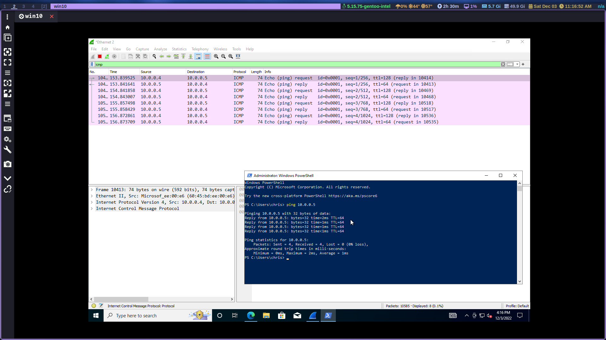
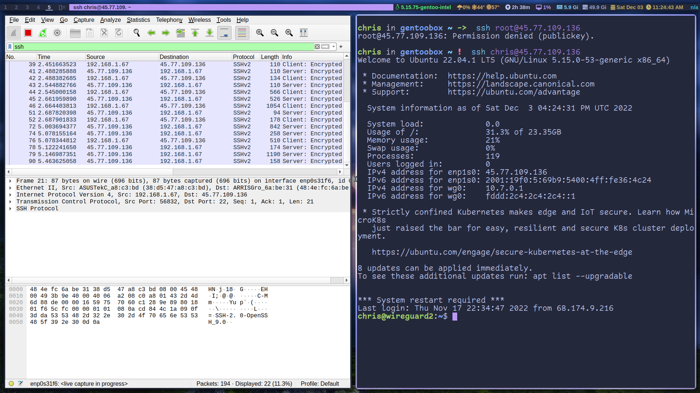
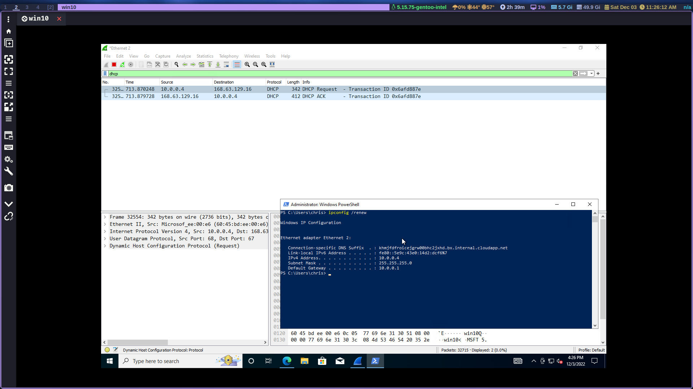
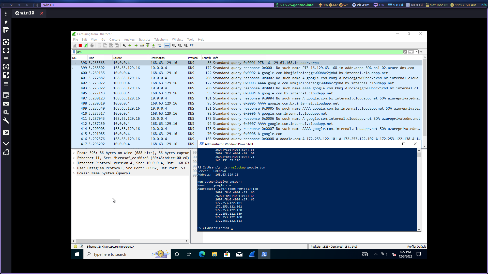
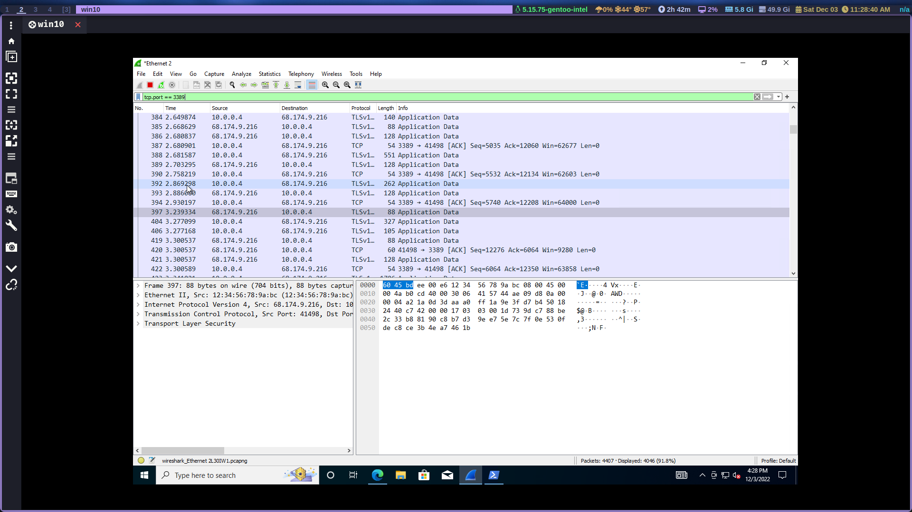

# Network Security Groups (NSGs) and Inspecting Traffic Between Azure Virtual Machines
In this tutorial, we observe various network traffic to and from Azure Virtual Machines with Wireshark as well as experiment with Network Security Groups.  

## Environments and Technologies Used

- Microsoft Azure (Virtual Machines/Compute)
- Remote Desktop
- Various Command-Line Tools
- Various Network Protocols (SSH, RDH, DNS, HTTP/S, ICMP)
- Wireshark (Protocol Analyzer)

## Operating Systems Used 

- Windows 10 (21H2)
- Ubuntu Server 20.04

## Needed

- Azure subscription 

## Creating our resources

1. Create a resource group
2. Create a Windows 10 Virtual Machine (VM)
  - While createing the VM, select the previously created Resource group
  - While creating the VM, allow it to create a new Virtual Network (Vnet) and Subnet
3. Create a Linux (Ubuntu) VM
  - While creating the VM, select the previously created Resource Group and Vnet: make sure you select password instead of SSH key.
4. Observe your Virtual Network within Network Watcher

## Observe ICMP Traffic 

*ICMP Wireshark traffic*

5. Use Remote Desktop to conncet to your Windows 10 VM
6. Within your windows 10 VM, install Wireshark
7. Open Wireshark and filter for ICMP traffic only
8. Retrieve the private IP address of the Ubuntu VM and attempt to ping it from within the Windows 10 VM
  - Observe ping request and replies within Wireshark 
9. From the Windows 10 VM, open Powershell and ping a public website (google.com) and observe the traffic in Wireshark
10. Initiate a perpetual/non-stop ping from your Windows 10 VM to your ubuntu VM (small vid)
  - Go back on Azure and Open the Network Security Group your Ubuntu VM is using and disable incoming (inbound)ICMP traffic 
  - Back in the Windows VM, observe the ICMP traffic in Wiresharkand the command line ping activity
  - Re-enable ICMP traffic for the Ubuntu VM
  - Go back to the Windows VM and observe the ICMP traffic in wireshark and command line resume
  - Stop the ping activity

## Observe SSH Traffic 

*SSH Wireshark traffic*

11. Back in wireshark, filter for SSH traffic only
12. From your Windows VM SSH into your Ubuntu virtual Machine, `ssh user@privateIP`
  - Type commands (ls, pwd and more) into the SSH session and observe SSH traffic spam in Wireshark
  - Exit the SSH session with control+d 

## Observe DHCP Traffic

*DCHP Wireshark traffic*

13. Back in Wireshark, filter for DHCP traffic only
14. From your Windows VM attempt to issue your Vm a new IP with the command `ipconfig /renew`
  - Observe the DHCP traffic appearing in Wireshark

## Observe DNS Traffic

*DNS Wireshark traffic*

15. Back in Wireshark, fileter for DNS traffic only
16. From your Window VM in Powershell use the command `nslookup` to see what google.com and disney.com's Ip addresses are
  - Observe the DNS traffic being shown in Wireshark

## Observe RDP Traffic

*RDP Wireshark traffic*

17. Back in Wireshark, filter for RDP traffic only by typing `tcp.port == 3389`
18. Observe the immediate non-stop spam of traffic. Since we're in a live connection to our VM the traffic is going to be constantly transmitted.

## Clean up our resources

Now that we're done and we learned a bit about network protocols let's clean up our resources at Azure and delete all Resource groups and VM's. Make sure you verify resource group deletion. 

